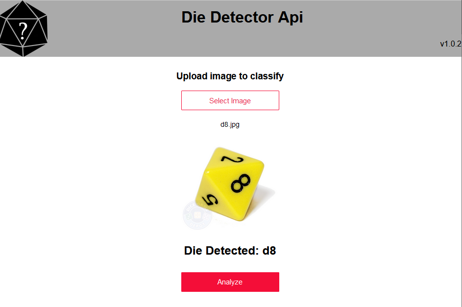

# die-detector-api
Website for dice type detector. 

I used fastai and pytorch to train a model to detect what type of dice an image is of. 
Classes are: ['d10', 'd12', 'd20', 'd4', 'd6', 'd8']

Upload an image of a single die and it will classify which type it is.

The dataset based off of https://www.kaggle.com/ucffool/dice-d4-d6-d8-d10-d12-d20-images by Mario Lurig.

## Building

Python 3.6

On linux use `gunicorn` and on 
`gunicorn app:app --bind 0.0.0.0:5000`

windows use `waitress`
`waitress-serve --listen=127.0.0.1:5000 app:app`
